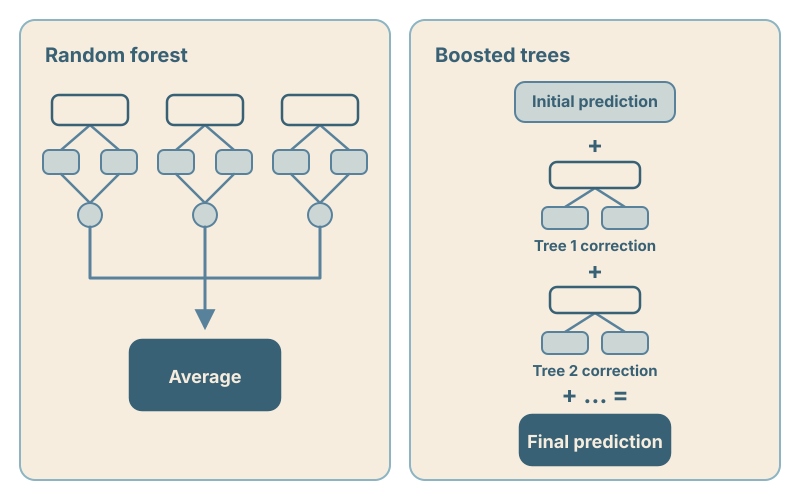

Predicting an outcome, describing a conditional association, explaining a fitted model, and estimating a causal effect are not interchangeable tasks, and the scientific question should come before the choice of algorithm.
The prediction example estimates a patient's probability of hospital admission from clinical and contextual characteristics.
The causal example estimates how hospital-free days would differ during a follow-up period under environmental exposure condition X versus condition Y.

| Primary question | Estimand or target | Typical method | Main output |
|---|---|---|---|
| What outcome is expected for a new observation? | A conditional probability, mean, or other predictive quantity | Linear or logistic regression, random forest, or boosting | Prediction with validated performance |
| What conditional association is described by a specified model? | A specified regression coefficient or contrast | Linear or generalized linear model | Coefficient, standard error, and confidence interval |
| Which inputs did this fitted prediction model rely on? | Reliance or attribution within the fitted model | Permutation importance, gain, feature attribution, or conditional plots | A model-behavior summary |
| What is the effect of environmental exposure condition X rather than condition Y? | An average or conditional average exposure effect, or another causal contrast | Outcome regression, weighting, doubly robust methods, or causal forest | A causal-effect estimate under stated assumptions |

## A supervised machine-learning model automatically learns a prediction rule, not a causal mechanism.

A supervised machine-learning model is an estimated rule that maps input characteristics to an outcome.
The algorithm learns that rule from examples by minimizing a loss function.
For hospital-admission prediction, the inputs might include age, oxygen saturation, symptoms, prior healthcare use, area-level measures of material deprivation, or individual-level estimates of environmental exposures.
The model's first obligation is to perform well for its stated task *in data that were not used to fit or tune it*.
Relevant aspects of evaluation may include discrimination, calibration, prediction error, transportability, and decision utility.
Good predictive performance in the evaluated setting does not reveal why the outcome occurs or what would happen after changing an exposure.

> A predictive model is not automatically a biological explanation, a causal model, or a statement about which variables are statistically significant.

📚 Hastie, Tibshirani, and Friedman, [*The Elements of Statistical Learning*](https://hastie.su.domains/ElemStatLearn/).

💻 R—[`tidymodels`](https://www.tidymodels.org/) or [`mlr3`](https://mlr3.mlr-org.com/). Python—[`scikit-learn`](https://scikit-learn.org/stable/).

## Regression models are useful reference points when learning about tree-based models.

For *prediction*, linear and logistic regression are evaluated as complete fitted models.
For *description or inference*, investigators interpret specified coefficients, standard errors, confidence intervals, and hypothesis tests.
For *causal estimation*, investigators use models to estimate a predefined exposure contrast under stated causal assumptions.

In the causal example, an investigator might use regression to compare expected hospital-free days under environmental exposure condition X versus condition Y after adjusting for measured pre-exposure confounders (that is, characteristics that could cause differences in both the exposure experienced and the number of hospital-free days).
The fitted model defines a conditional contrast; in a simple model, an exposure coefficient may represent that contrast on the model's link scale.
Its causal interpretation still depends on the study design, time ordering, consistency, positivity, model specification, and no important unmeasured confounding.
Adding covariates to a regression does not create those conditions.

Regression models commonly provide named coefficients, standard errors, confidence intervals, and hypothesis tests for prespecified terms.
Tree ensembles usually do not provide an analogous coefficient and 95% confidence interval for every input.

📚 McCullagh and Nelder, [*Generalized Linear Models*](https://doi.org/10.1201/9780203753736); Hernán and Robins, [*Causal Inference: What If*](https://miguelhernan.org/whatifbook).

💻 R—base [`stats::lm()` and `stats::glm()`](https://stat.ethz.ch/R-manual/R-devel/library/stats/html/00Index.html). Python—[`statsmodels`](https://www.statsmodels.org/stable/).

## Regression and classification trees are inspectable sequences of splits and terminal groups.

A tree repeatedly divides observations using rules such as age under 2 years, oxygen saturation below 92%, or at least three days with poor air quality.
Each split is chosen to make the resulting groups more homogeneous with respect to the outcome.
Trees can also represent conditional relationships directly.
For example, the predictive meaning of recent air quality or oxygen saturation may differ according to a child's age.

[Open the full-size figure.](decision-tree.svg)

A *classification* tree may estimate hospital-admission probability as the fraction of patients in each terminal node who were admitted.
A *regression* tree may estimate length of stay as the average among patients in a terminal node.
Trees naturally represent thresholds, nonlinearities, and interactions.

A modest-sized tree is inspectable but unstable: early splits affect every later branch, and small data changes can produce a different tree.
Depth, minimum leaf size, pruning, and validation therefore matter.
For a detailed visual example, scikit-learn's [Iris decision-tree demonstration](https://scikit-learn.org/stable/auto_examples/tree/plot_iris_dtc.html) displays a fitted tree with split rules, branches, and terminal nodes.

📚 Breiman, Friedman, Olshen, and Stone, [*Classification and Regression Trees*](https://doi.org/10.1201/9781315139470).

💻 R—[`rpart`](https://search.r-project.org/CRAN/refmans/rpart/html/rpart.html). Python—[`sklearn.tree`](https://scikit-learn.org/stable/modules/tree.html).

## Tree ensembles combine many unstable trees to improve prediction.

Single trees can change substantially when the training data change slightly and may have limited predictive accuracy.
An ensemble combines many trees so that their individual weaknesses are less consequential.
*Random forests* grow many randomized trees in parallel and average their predictions.
*Boosted trees* grow trees sequentially, with each new tree adding a correction to the current model.

[Open the full-size figure.](tree-ensembles.svg)

The fitted model in each case is the ensemble, not any one tree.
There are usually no single coefficients for each input, routine variable-by-variable p-values, or coefficient-style 95% confidence intervals for every feature.
Evaluation begins with out-of-sample performance.
Interpretation is a separate step that asks how the fitted ensemble used its inputs.

📚 Hastie, Tibshirani, and Friedman, [*The Elements of Statistical Learning*, chapters 10 and 15](https://hastie.su.domains/ElemStatLearn/).

## Random forests average many decorrelated trees to reduce prediction variance.

A random forest typically fits each tree on a bootstrap sample of the training observations, considers a random subset of predictors at each split, and averages the resulting predictions.
The randomization makes the trees less similar, so averaging can reduce variance more effectively than averaging many nearly identical trees.
Important tuning choices include the number of predictors considered at each split and constraints on tree complexity, such as minimum node or leaf sizes.

Each training observation is absent from the bootstrap sample used to grow *some* trees.
Its *out-of-bag* prediction is calculated using only those trees that did not use the observation during fitting.
Aggregating these predictions across observations provides a convenient internal estimate of out-of-sample performance without setting aside another portion of the training data.

Out-of-bag evaluation is neither ordinary cross-validation nor an independently refitted model.
It can be used to compare tuning choices, but extensive selection based on the same out-of-bag results can make the final reported performance optimistic.
Independent evaluation remains important, and external validation is necessary when the model will be used in another setting or population.

“Many trees voting” is a useful, but incomplete, understanding of random forests.
A forest can also be viewed as learning an adaptive neighborhood: training observations influence a target prediction when they share terminal leaves with it, generally receiving more weight when they do so more often.
This perspective connects ordinary random forests to generalized random forests (more on those later).
In the illustration, × marks the target observation, and darker, larger dots represent more shared leaves.

[Open the full-size figure.](forest-adaptive-neighborhood.svg)

📚 Breiman, [“Random Forests”](https://doi.org/10.1023/A:1010933404324).

💻 R—[`ranger`](https://imbs-hl.github.io/ranger/) and [`randomForestSRC`](https://www.randomforestsrc.org/). Python—[`sklearn.ensemble`](https://scikit-learn.org/stable/modules/ensemble.html#forest).

## Boosted trees improve a model through a sequence of small corrections.

In gradient boosting, each new tree moves the model in the direction that most improves a chosen loss function.
The final prediction is an additive combination of many (usually shallow) trees.
Important tuning choices include *tree depth*, which limits interaction complexity; *learning rate*, which controls the contribution of each new tree; and the *number of trees*, which controls how long learning continues.

These choices should be tuned without using the final test set.
Strong discrimination for hospital admission still does not guarantee calibration, transportability, fairness, or clinical utility.

📚 Friedman, [“Greedy Function Approximation: A Gradient Boosting Machine”](https://doi.org/10.1214/aos/1013203451); Chen and Guestrin, [“XGBoost: A Scalable Tree Boosting System”](https://arxiv.org/abs/1603.02754).

💻 R and Python—[`xgboost`](https://xgboost.readthedocs.io/), [`LightGBM`](https://lightgbm.readthedocs.io/), and [`CatBoost`](https://catboost.ai/).

## Variable-importance methods describe how a fitted model used its inputs.

After establishing adequate performance in held-out data, investigators often ask which inputs the model relied on.
*Variable importance* is a family of model-inspection summaries, and each method asks a different question:

- *Impurity or gain importance* asks which variables improved training splits. It can favor variables with many possible split points and reflect overfitted patterns in the training data.
- *Permutation importance* asks how much held-out performance deteriorates when one variable is shuffled. It depends on the model, evaluation data, metric, and whether shuffling creates unrealistic combinations of correlated inputs.
- *SHAP (SHapley Additive exPlanations) values* ask how feature contributions account for a prediction relative to a reference value. They depend on the reference distribution and assumptions about feature dependence.

Individual SHAP values are local explanations of single predictions.
Aggregating absolute SHAP values produces a global summary that can hide effects differing in direction or across groups.
Correlated variables can also substitute for one another, distributing or hiding importance.

As we discussed in the earlier tree example, if oxygen saturation contributes differently according to age, its overall importance does not reveal those patterns.
Ordinary feature-level SHAP attributions can distribute the contribution of an interaction across the participating features without identifying the interaction itself.
Interaction-focused summaries or carefully chosen conditional plots are needed to examine it.

Repeating permutations or refitting a randomized model with different seeds on the same data can describe Monte Carlo or stability variability in rankings or selected features.
Intervals formed from those repetitions are not coefficient-style 95% confidence intervals and do not test a scientific null hypothesis.

> Importance means that a particular fitted model relied on a feature, not that changing the feature would change the outcome.

📚 Breiman, [“Random Forests”](https://doi.org/10.1023/A:1010933404324) for permutation importance; Lundberg and Lee, [“A Unified Approach to Interpreting Model Predictions”](https://arxiv.org/abs/1705.07874) for SHAP.

💻 R—[`vip`](https://search.r-project.org/CRAN/refmans/vip/html/00Index.html) and [`fastshap`](https://bgreenwell.github.io/fastshap/). Python—[`sklearn.inspection.permutation_importance`](https://scikit-learn.org/stable/modules/permutation_importance.html) and [`shap`](https://shap.readthedocs.io/).

## Different forms of uncertainty answer different questions.

An interval is meaningful only when the reader knows what varies across hypothetical repetitions and what quantity it is intended to cover.

| Quantity under study | What the interval or variability describes | What it does not establish |
|---|---|---|
| A specified regression coefficient or contrast | Sampling uncertainty under the specified model | A causal effect without an appropriate design and assumptions |
| A conditional mean, quantile, or other local target | Pointwise uncertainty in the estimated target at a specified covariate profile | The range of outcomes for one future individual |
| A conditional average exposure effect | Pointwise uncertainty in a conditional exposure effect under causal-identification and regularity assumptions | An individual's unknowable causal effect or simultaneous coverage of all searched subgroups |
| A future individual outcome | Variation in outcomes among similar future observations, represented by a predictive distribution or prediction interval when appropriate | Uncertainty in the conditional mean alone |
| Repeated permutation importance or randomized model refits | Monte Carlo or stability variability conditional on the data and fitted procedure | A coefficient confidence interval or test of a scientific hypothesis |

## Generalized random forests support inference for specified local targets.

An ordinary regression forest predicts a conditional mean from training outcomes in its adaptive neighborhood.
Generalized random forests (GRF) retain the adaptive-neighborhood idea but grow task-specific forests and use the resulting weights to solve a local estimating equation.
The investigator specifies that equation to define the quantity of interest.
Possible targets include conditional means, quantiles, conditional average partial effects, instrumental-variable estimands, and conditional exposure effects.

The central technical contribution of GRF is a large-sample theory for these forest estimates.
Under stated regularity conditions, the estimate is consistent and asymptotically normal.
An estimate of its sampling variance therefore provides a standard error and an approximate pointwise 95% confidence interval for the specified target.
This is inference for a conditional statistical quantity, not a coefficient and p-value for every input.

The theory depends on how the forest is grown.
In an *honest* forest, one portion of each subsample chooses the splits and another portion estimates values within the resulting leaves.
Honesty and subsampling limit adaptive reuse of outcomes and support the large-sample approximation.
Adequate local sample information and appropriate leaf sizes—and, for causal targets, exposure overlap—remain necessary.

Sampling variance and finite-forest Monte Carlo error are different.
Sampling variance describes how the estimate would change across new samples from the target population.
Finite-forest or *excess* error arises because a randomized forest contains only a limited number of trees.
Growing more trees can reduce excess error, but it does not create more independent patients or eliminate sampling uncertainty.

GRF is therefore not a universally better prediction model; rather, it changes the target of forest estimation and, for supported targets, provides an associated variance estimate.

📚 Athey, Tibshirani, and Wager, [“Generalized Random Forests”](https://arxiv.org/abs/1610.01271).

💻 R—[`grf`](https://grf-labs.github.io/grf/).

## Causal forests target heterogeneous exposure effects under causal assumptions.

A causal forest is a generalized random forest specialized for heterogeneous exposure-effect estimation.
In the running example, its conditional average exposure effect—conventionally called a conditional average treatment effect (CATE) in causal-forest literature—is the expected difference in hospital-free days under environmental exposure condition X rather than condition Y among patients with similar measured pre-exposure characteristics.
This conditional effect is an average for a covariate-defined group, not an individual causal effect.

For observational data, a typical workflow estimates the probability of environmental exposure condition X rather than condition Y and the expected outcome given pre-exposure characteristics.
It uses out-of-bag or cross-fitted predictions to residualize exposure and outcome before learning effect heterogeneity.
This orthogonalization reduces sensitivity to errors in the nuisance models.
It does not measure unrecorded confounders or make an unidentified causal contrast identifiable.

The design must define both exposure conditions, time zero, follow-up, outcome, and target population.
Potential confounders must be measured before exposure.
Exchangeability requires no important unmeasured confounding after conditioning on those variables.
Positivity requires a meaningful chance of experiencing either exposure condition across the covariate profiles being studied.
Consistency requires sufficiently well-defined exposure conditions.
Missingness and censoring must also be addressed appropriately.

Several related questions about heterogeneity require different analyses:

- *Pointwise conditional exposure-effect estimation* asks for the expected contrast at a specified covariate profile and may include a pointwise confidence interval.
- *Testing for meaningful heterogeneity* asks whether the forest has found reproducible variation in exposure effects. Out-of-bag calibration tests or rank-weighted average treatment-effect (RATE) summaries evaluated on held-out or cross-fitted data can address this question.
- *Describing effect modifiers* asks whether prespecified characteristics explain exposure-effect variation. Subgroup contrasts or best linear projections are often easier to communicate than individual conditional-effect estimates.
- *Exposure-mitigation prioritization or policy learning* asks whether a rule targeting exposure reduction or mitigation improves outcomes. Its value must be evaluated in data not used to construct it.

Flexible conditional exposure-effect estimates can be noisy, especially where exposure overlap or sample size is limited.
Scanning many pointwise confidence intervals is not a reliable test of heterogeneity and introduces a multiple-comparisons problem.
A pointwise interval for one covariate profile does not provide simultaneous coverage for every profile or subgroup examined after fitting.
Out-of-bag calibration and held-out or cross-fitted [RATE assessments](https://grf-labs.github.io/grf/articles/rate.html) more directly evaluate whether estimated exposure-effect variation is reproducible.

📚 Wager and Athey, [“Estimation and Inference of Heterogeneous Treatment Effects using Random Forests”](https://arxiv.org/abs/1510.04342); Athey, Tibshirani, and Wager, [“Generalized Random Forests”](https://arxiv.org/abs/1610.01271).

🧭 GRF documentation on [evaluating a causal forest](https://grf-labs.github.io/grf/articles/diagnostics.html) and [assessing heterogeneity with RATE](https://grf-labs.github.io/grf/articles/rate.html).

💻 R—[`grf`](https://grf-labs.github.io/grf/). Python—[`econml.dml.CausalForestDML`](https://www.pywhy.org/EconML/_autosummary/econml.dml.CausalForestDML.html), whose implementation and estimand details differ from R's `grf`.

## The scientific question determines the method and interpretation.

Prediction, conditional association, model interpretation, and causal estimation are different tasks.
A method is appropriate only when its target matches the scientific question and its evaluation matches the intended use.
Tree-based algorithms can play different roles across these settings; interpretation comes from the estimand, study design, assumptions, fitting procedure, validation strategy, and reporting.
Choosing those elements explicitly is what turns a flexible algorithm into a scientifically meaningful analysis.
