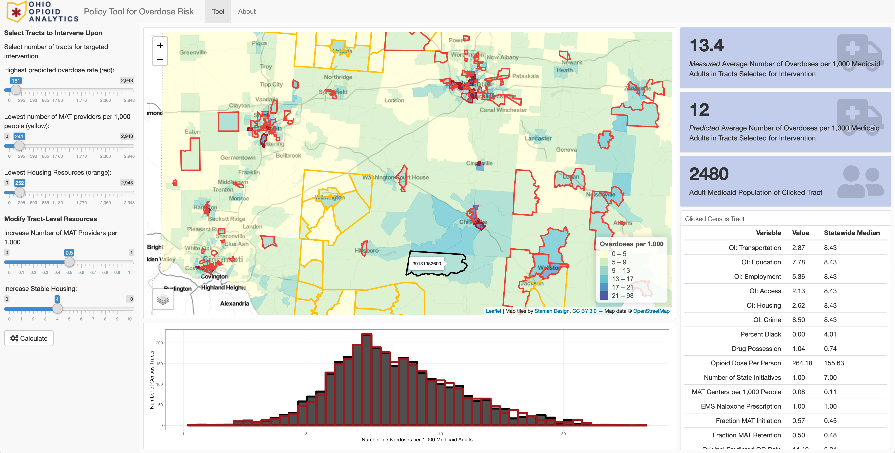
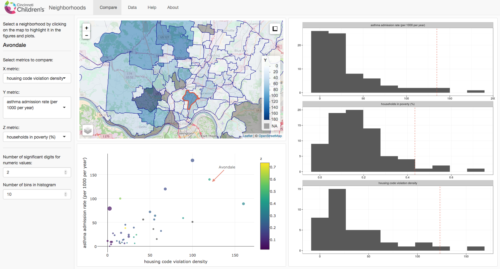
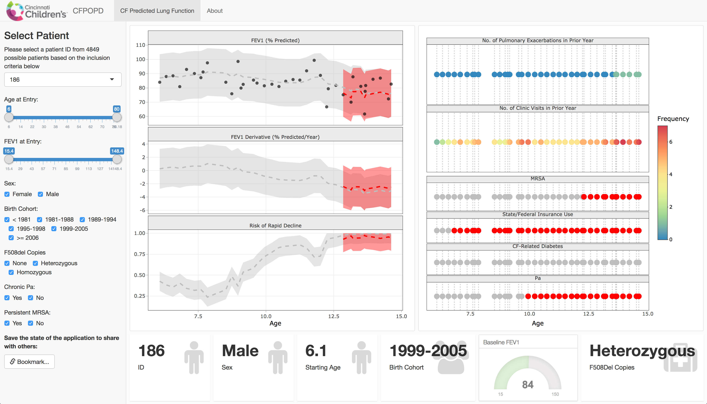
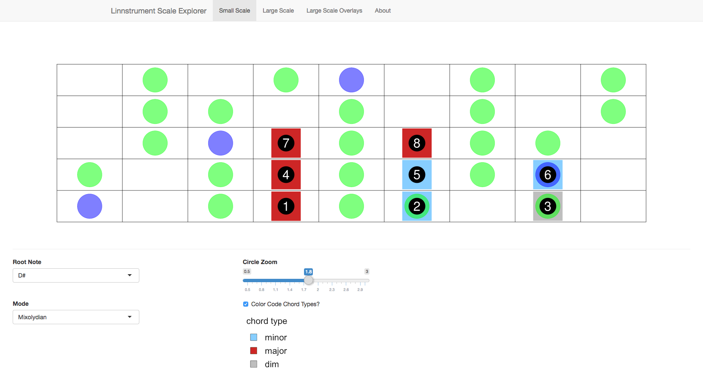

```{r eval=FALSE, include=FALSE}
# use this command when adding new app screen shots
webshot::appshot('~/Biostatistics/rhonda_weiji_shiny/cfpopd',
                 'appshots/cfpopd.png', delay=5)
webshot::webshot('http://cfpopd.amazon-shiny.duckdns.org/',
                 'appshots/cfpopd.png', delay=100)
```
&nbsp;

### Ohio Opioid Analytics Project

<div class = "row">

<div class = "col-md-6">

</div>

<div class = "col-md-6">
Developed in partnership with the Government Resource Council and the State of Ohio, this interactive geospatial data application predicts opioid-related overdoses per 1,000 Ohio adult Medicaid enrollees. Predicted rates are based on ecological factors that can be altered to illustrate a potential outcome based on a hypothetical policy intervention. 
</div>

</div>
&nbsp;

### [Cincinnati Neighborhoods](http://geomarker.io/neighborhood)

<div class = "row">

<div class = "col-md-6">
[](http://geomarker.io/neighborhood)
</div>

<div class = "col-md-6">
An R Shiny application which allows for comparing Cincinnati Neighborhoods. Basic socioeconomic information, hospital bed day utilization by cause, and environmental exposures are all presented in order to allow the user to simultaneously overlay multiple sources of information.
</div>

</div>

&nbsp;

### [CF Point of Personalized Detection (CFPOPD)](http://cfpopd.app.colebrokamp.com/)

<div class = "row">

<div class = "col-md-6">
[](http://cfpopd.app.colebrokamp.com/)
</div>

<div class = "col-md-6">
Dr. Rhonda Szczesniak (Cincinnati Children's) has recently used functional data analysis combined with joint modeling (FD-JM) to identify and predict rapid decline in lung function among patients with cystic fibrosis (CF) lung disease. Ongoing work with the CF Foundation Patient Registry (CFFPR) to implement these models and visualizations into clinical settings has improved prognostic care. This CFPOPD clinician GUI prototype was generated using R shiny and the flexdashboard package.
</div>

</div>

&nbsp;

### Combined Sewer Overflow Dashboard

<div class = "row">

<div class = "col-md-6">

</div>

<div class = "col-md-6">
An R Shiny application used to explore combined sewer overflow events and their effect on the probability of a CCHMC emergency department visit.
</div>

</div>

&nbsp;


### Ultrafine Particles Dashboard

<div class = "row">

<div class = "col-md-6">

</div>

<div class = "col-md-6">
An R Shiny application used to interactively explore and showcase data from a personal sampler that records GPS location and a total count of ultrafine particle air pollution every second.  
</div>

</div>

&nbsp;  

### [LinnStrument Scales](http://lse.app.colebrokamp.com)

<div class = "row">

<div class = "col-md-6">
[](http://lse.app.colebrokamp.com)
</div>

<div class = "col-md-6">
An R Shiny application ([source code](https://github.com/cole-brokamp/linnstrument_scales)</icon></icon>) that illustrates notes on LinnStrument for any given base key and scale mode. A navigation bar offers three modes: (1) small scale that only shows one octave of a scale with note numbers, (2) large scale that shows the scale over several octaves without note numbers, and (3) large scale overlays that shows one large scale and a different scale overlapping in order to compare scale layouts for different base keys and modes.
</div>

</div>

&nbsp;

### Location-based Prediction of Air Pollution Exposure

<div class = "row">

<div class = "col-md-12">
An R Shiny application which allows uploading of latitude and longitude coordinates and returns the estimated average daily exposure to traffic related air pollution. Optionally, it can also return the distance to the nearest interstate and highway, as well as various other census tract derived variables. This tool has been widely used within the Cincinnati Children's Hospital Medical Center in both clinical and research settings.
</div>

</div>

<div class = "row">

<div class = "col-md-6">
**Single Address with Visual Map**
 
</div>

<div class = "col-md-6">
**Batch Submission of Coordinates**

</div>
</div>
