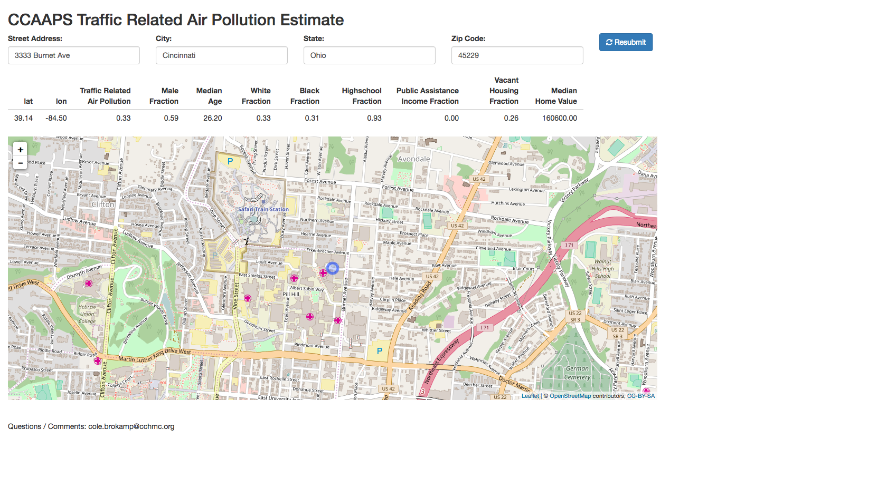

&nbsp;

### **[Cincinnati Neighborhoods](http://geomarker.io/neighborhood)**

An R Shiny application which allows for comparing Cincinnati Neighborhoods. Basic socioeconomic information, hospital bed day utilization by cause, and environmental exposures are all presented in order to allow the user to simultaneously overlay multiple sources of information.

 

&nbsp;

### **Combined Sewer Overflow Dashboard**

An R Shiny application used to explore combined sewer overflow events and their effect on the probability of a CCHMC emergency department visit.

&nbsp;

### **[LinnStrument Scales](http://linnstrument-scales.amazon-shiny.duckdns.org)**

An R Shiny application ([source code](https://github.com/cole-brokamp/linnstrument_scales)</icon></icon>) that illustrates notes on LinnStrument for any given base key and scale mode. A navigation bar offers three modes: (1) small scale that only shows one octave of a scale with note numbers, (2) large scale that shows the scale over several octaves without note numbers, and (3) large scale overlays that shows one large scale and a different scale overlapping in order to compare scale layouts for different base keys and modes.

&nbsp;

### **Ultrafine Particles Dashboard**

An R Shiny application used to interactively explore and showcase data from a personal sampler that records GPS location and a total count of ultrafine particle air pollution every second.  

&nbsp;  

### **Location-based Prediction of Air Pollution Exposure**

An R Shiny application which allows uploading of latitude and longitude coordinates and returns the estimated average daily exposure to traffic related air pollution. Optionally, it can also return the distance to the nearest interstate and highway, as well as various other census tract derived variables. This tool has been widely used within the Cincinnati Children's Hospital Medical Center in both clinical and research settings.

#### [Single Address with Visual Map](http://ecat-map.amazon-shiny.duckdns.org)

 

&nbsp;  

#### [Batch Submission of Coordinates](http://ecat-file.amazon-shiny.duckdns.org)

  