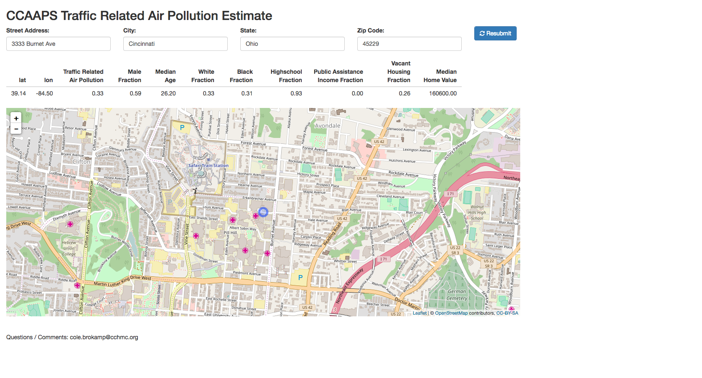
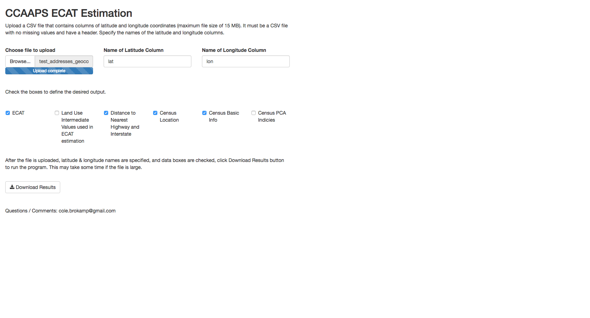

&nbsp;  

### **Location-based Prediction of Air Pollution Exposure**

An R Shiny application which allows uploading of latitude and longitude coordinates and returns the estimated average daily exposure to traffic related air pollution. Optionally, it can also return the distance to the nearest interstate and highway, as well as various other census tract derived variables. This tool has been widely used within the Cincinnati Children's Hospital Medical Center in both clinical and research settings.

#### [Single Address with Visual Map](http://ecat-map.amazon-shiny.duckdns.org)

 

&nbsp;  

#### [Batch Submission of Coordinates](ecat-file.amazon-shiny.duckdns.org)

  