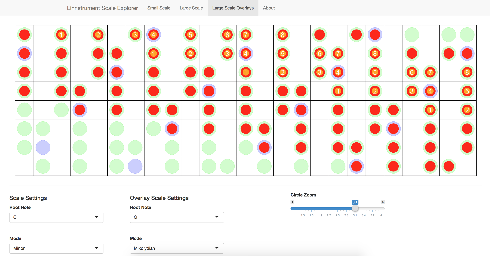

&nbsp;  

### **LinnStrument Scales**

An R Shiny application ([source code](https://github.com/cole-brokamp/linnstrument_scales)</icon></icon>) that illustrates notes on LinnStrument for any given base key and scale mode. A navigation bar offers three modes: (1) small scale that only shows one octave of a scale with note numbers, (2) large scale that shows the scale over several octaves without note numbers, and (3) large scale overlays that shows one large scale and a different scale overlapping in order to compare scale layouts for different base keys and modes.

