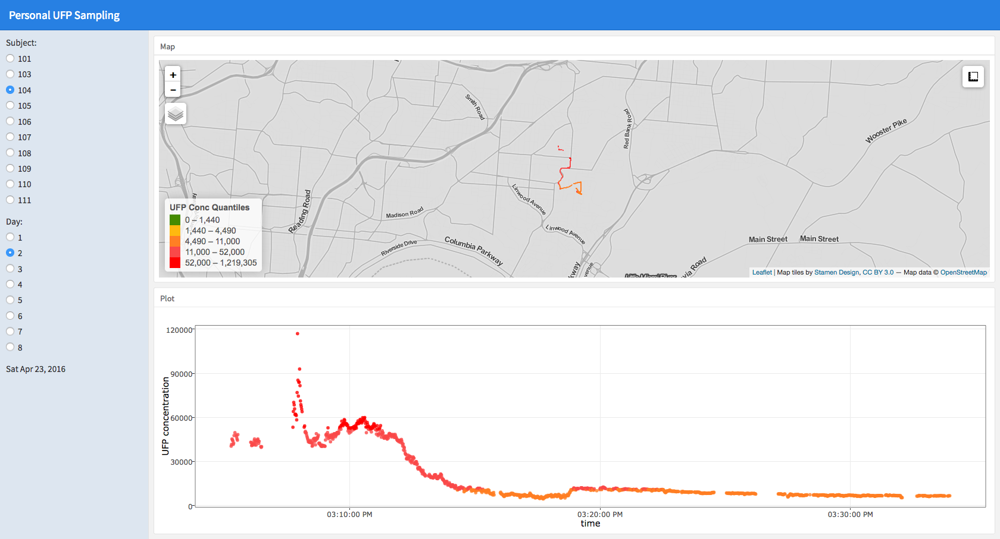

&nbsp;  

### **Ultrafine Particles Dashboard**

An R Shiny application used to interactively explore and showcase data from a personal sampler that records GPS location and a total count of ultrafine particle air pollution every second.  

